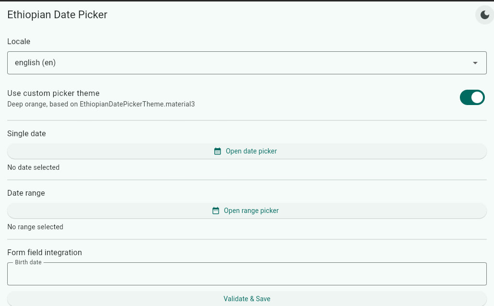
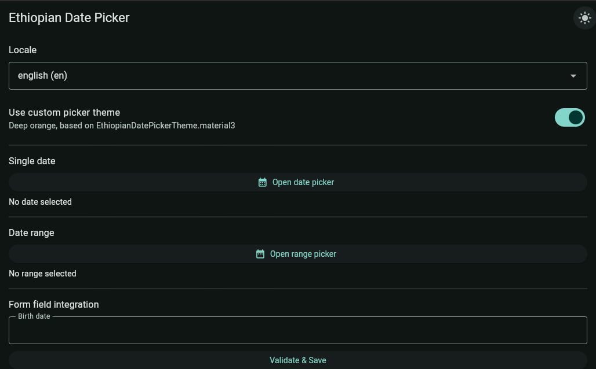
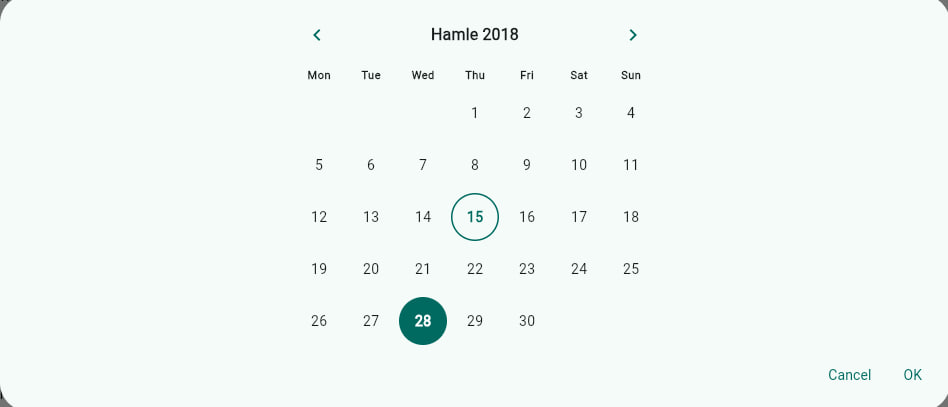
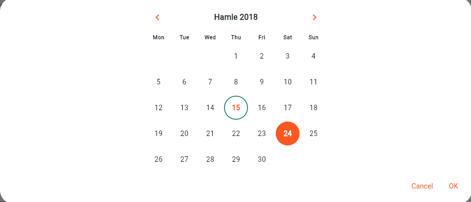
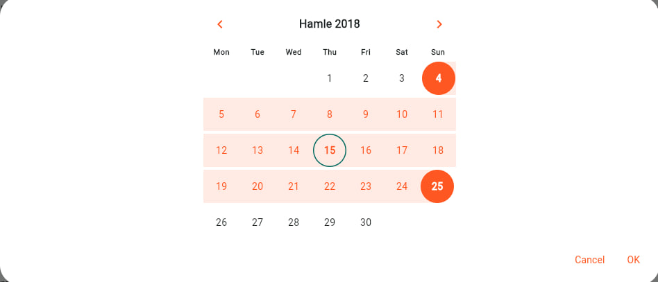
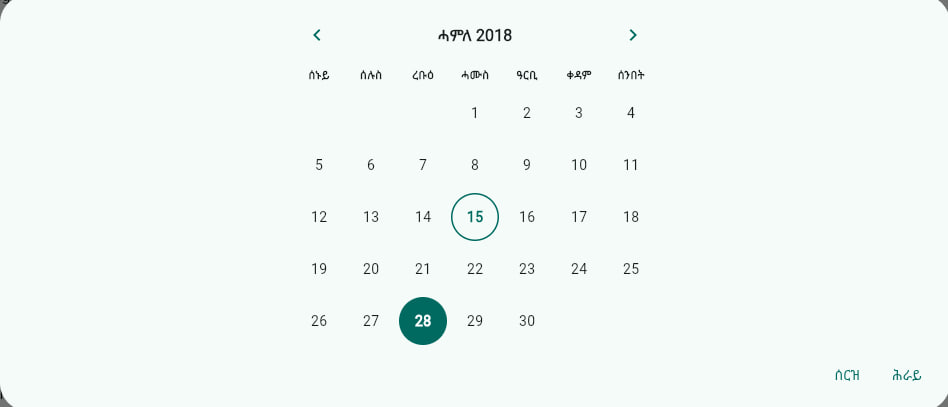
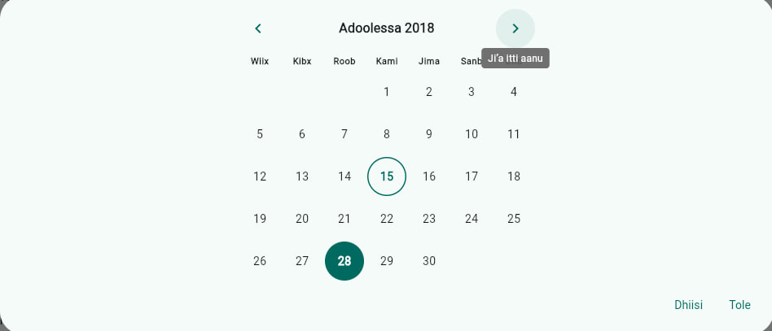

# flutter_ethiopian_date_picker

A Flutter package for working with the Ethiopian (Ge'ez) calendar — conversion, a
Material 3 date picker, range selection, form field integration, theming, and
localization (English, Amharic, Afaan Oromo, Tigrinya).

## Screenshots

<table>
  <tr>
    <td align="center"><br><sub>Example app — light theme</sub></td>
    <td align="center"><br><sub>Example app — dark theme</sub></td>
  </tr>
  <tr>
    <td align="center"><br><sub>Date picker — default theme</sub></td>
    <td align="center"><br><sub>Date picker — custom theme (deep orange)</sub></td>
  </tr>
  <tr>
    <td align="center"><br><sub>Range picker — selected range</sub></td>
    <td align="center"><br><sub>Localized — Tigrinya (ትግርኛ)</sub></td>
  </tr>
</table>

<details>
<summary>More locales (Amharic, Afaan Oromo)</summary>

<table>
  <tr>
    <td align="center"><br><sub>Localized — Amharic (አማርኛ)</sub></td>
    <td align="center"><br><sub>Localized — Afaan Oromo, with keyboard-focus tooltip</sub></td>
  </tr>
</table>

</details>

## Installation

```yaml
dependencies:
  flutter_ethiopian_date_picker: ^0.4.0
```

```
flutter pub get
```

## Simple usage

One line, zero config:

```dart
final date = await showEthiopianDatePicker(context: context);
```

## Advanced usage

```dart
final date = await showEthiopianDatePicker(
  context: context,
  initialDate: EthiopianDate.today(),
  firstDate: EthiopianDate(2010, 1, 1), // positional: year, month, day
  lastDate: EthiopianDate(2020, 13, 5),
  locale: EthiopianLocale.amharic.code, // locale param takes a String code
  theme: EthiopianDatePickerTheme.material3(context).copyWith(
    primaryColor: Colors.deepOrange,
    selectedColor: Colors.deepOrange,
    backgroundColor: Colors.white,
  ),
);
```

> `EthiopianDatePickerTheme` has no lightweight constructor — every field
> (including `onSelectedColor`, `todayBorderColor`, `disabledColor`) is
> required. Build a custom theme by calling `.material3(context)` for the
> Material 3 defaults, then `.copyWith(...)` the colors you want to change.

### Range selection

```dart
final range = await showEthiopianDateRangePicker(
  context: context,
  firstDate: EthiopianDate(2010, 1, 1),
  lastDate: EthiopianDate(2020, 13, 5),
);

if (range != null) {
  print('${range.start} → ${range.end}');
}
```

### Converting between calendars

```dart
final ethiopian = EthiopianDate.fromGregorian(DateTime.now());
final gregorian = ethiopian.toGregorian();

// DateTime extension
final today = DateTime.now().toEthiopianDate();
```

## Widget usage (embedded, not a dialog)

```dart
class MyEmbeddedCalendar extends StatefulWidget {
  const MyEmbeddedCalendar({super.key});

  @override
  State<MyEmbeddedCalendar> createState() => _MyEmbeddedCalendarState();
}

class _MyEmbeddedCalendarState extends State<MyEmbeddedCalendar> {
  EthiopianDate _displayedMonth = EthiopianDate.today();
  EthiopianDate? _selectedDate;

  @override
  Widget build(BuildContext context) {
    return EthiopianCalendarView(
      displayedMonth: _displayedMonth,
      firstDate: EthiopianDate(2010, 1, 1),
      lastDate: EthiopianDate(2020, 13, 5),
      selectedDate: _selectedDate,
      onDateSelected: (date) => setState(() => _selectedDate = date),
      onMonthChanged: (month) => setState(() => _displayedMonth = month),
    );
  }
}
```

`EthiopianCalendarView` is fully stateless and controlled: it doesn't track
displayed month or selection itself — the caller owns both via
`displayedMonth`/`selectedDate` (or `selectedRange` for range mode, which
takes priority over `selectedDate` if both are set) and reacts to
`onDateSelected`/`onMonthChanged`.

`EthiopianCalendarView` is stateless and fully controlled — pass the selected
date back in via `initialDate`/state management of your choice (Provider,
Riverpod, and Bloc are all smoke-tested; see `test/state_management_smoke_test.dart`).

## Form field usage

```dart
Form(
  key: _formKey,
  child: EthiopianDateFormField(
    firstDate: EthiopianDate(2010, 1, 1),
    lastDate: EthiopianDate(2020, 13, 5),
    decoration: const InputDecoration(labelText: 'Birth date'),
    validator: (value) => value == null ? 'Required' : null,
    onSaved: (value) => _birthDate = value,
  ),
)
```

## Localization

```dart
showEthiopianDatePicker(
  context: context,
  locale: EthiopianLocale.oromo.code, // 'en', 'am', 'om', 'ti'
);
```

`EthiopianLocale` is the enum used for UI pickers (e.g. a locale dropdown);
every picker function takes the raw `String` code via `.code`, not the enum
itself.

An unsupported or missing locale falls back to English automatically.

## Theming

Pass an `EthiopianDatePickerTheme` to override `primaryColor`, `selectedColor`,
`backgroundColor`, spacing, and typography. With no theme provided, the picker
uses Material 3 defaults derived from the ambient `Theme.of(context)`.

## API reference

| API | Description |
|---|---|
| `EthiopianDate` | Core date model: `year`, `month`, `day`, validation, `today()`, comparisons (`compareTo`, `isBefore`, `isAfter`, `isAtSameMomentAs`), `toJson`/`fromJson`. |
| `EthiopianDate.fromGregorian(DateTime)` | Convert a `DateTime` to `EthiopianDate`. |
| `EthiopianDate.toGregorian()` | Convert back to a Gregorian `DateTime`. |
| `DateTime.toEthiopianDate()` | Extension method, equivalent to `EthiopianDate.fromGregorian`. |
| `showEthiopianDatePicker({...})` | Opens the picker dialog, returns `Future<EthiopianDate?>`. `null` on cancel. |
| `showEthiopianDateRangePicker({...})` | Opens the range picker dialog, returns `Future<EthiopianDateRange?>`. |
| `EthiopianDateRange` | `start`, `end` date pair. |
| `EthiopianCalendarView` | Embeddable, stateless calendar grid widget. Required: `displayedMonth`, `firstDate`, `lastDate`, `onDateSelected`, `onMonthChanged`. Optional: `selectedDate`, `selectedRange` (takes priority over `selectedDate`), `locale`, `theme`. |
| `EthiopianDateFormField` | `FormField<EthiopianDate>` — works with standard `Form`/`FormState`. |
| `EthiopianDatePickerTheme` | Visual customization: colors, spacing, typography. |
| `EthiopianLocale` | `en`, `am`, `om`, `ti` — enum used for all localized text. |

Full symbol-level API docs are published to pub.dev once released; until then
run `dart doc .` locally to browse.

## Supported features

- ✅ Gregorian ⇄ Ethiopian conversion (leap years, Pagume 5/6 days), fuzz-tested
- ✅ Single date picker dialog + embeddable calendar widget
- ✅ Date range selection (same-day, cross-month, cross-year)
- ✅ Material 3 theming with full override support
- ✅ Slide/fade month transitions, ripple selection, dialog animations
- ✅ Localization: English, Amharic, Afaan Oromo, Tigrinya (fallback to English)
- ✅ `Form`/`FormState` integration via `EthiopianDateFormField`
- ✅ Accessibility: semantic labels, full keyboard navigation, ≥48px touch targets,
  screen reader smoke-tested (VoiceOver/TalkBack)
- ✅ No internal global/static mutable state — safe with Provider, Riverpod, Bloc
- ✅ Golden-tested UI across all themes and locales
- 🚧 Platform verification matrix — see `PLATFORM_SUPPORT.md` (in progress)

## Example app

See `example/` for a runnable app covering: opening the picker, theme
switching (light/dark), locale switching, range picker, and form field usage.

```
cd example
flutter run
```

## Contributing / development

- `flutter analyze` and `flutter test` must pass before opening a PR (enforced
  in CI, see Task 0.2).
- Any change to the public API must update `CHANGELOG.md`.

## License

MIT (or BSD-3 — match whatever `LICENSE` was chosen in Task 0.1).